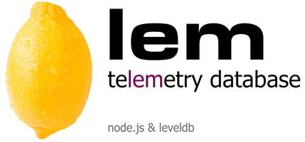

lem
===




database for time-series data using LevelDB and node.js

## installation

```
$ npm install lem
```

## usage

```js
var lem = require('lem');
var level = require('level');

// create a new leveldb - this can also be a sub-level
var leveldb = level('/tmp/lemtest');

// create a new lem store using the leveldb
var lemdb = lem(db);

// when nodes are indexed
lemdb.on('index', function(key, meta){

})

// a live stream from the database
lemdb.on('data', function(data){

})

// nodes are represented by keys
var key = 'myhouse.kitchen.fridge.temperature';

// index a node with some meta data
lemdb.index(key, 'My Fridge Temp');

// create a recorder which will write data to the node
var temp = lemdb.recorder(key);

// write a value every second
setInterval(function(){
	temp(Math.random()*100);
}, 1000)

```

## timestamps

When values are written to recorders - they are timestamped.  Sometimes - more acurate timestamping (like a GPS source) is used - you can provide the timestamp to the recorder:

```js
var temp = lemdb.recorder('timestamp.test');
setInterval(function(){
	// get a custom timestamp from somewhere - the current time is the default
	var timestamp = new Date().getTime();
	temp(Math.random()*100, timestamp);
}, 1000)
```

## index

You can read the index from any point in the tree - it returns a ReadStream of the keys that have been indexed:

```js
...
var through = require('through');

// index a key into the tree
lemdb.index('cars.red5.speed', 'The speed of the car', function(){
	var keysfound = {};

	// keys returns a readstream of objects each with a 'key' and 'data' property
	lemdb.keys('cars.red5').pipe(through(function(data){
		keysfound[data.key] = data.value;
	}, function(){
		console.log('Meta: ' + keysfound.speed);
	})
})
```

This will log:

```
Meta: The speed of the car
```

## valuestream

Create a ReadStream of telemetry values for a node - you can specify start and end keys to view windows in time:

```js

// create a range - this can be a 'session' to make meaningful groups within lem
var sessionstart = new Date('04/05/2013 12:34:43');
var sessionend = new Date('04/05/2013 12:48:10');
var counter = 0;
var total = 0;

var secs = (sessionend.getTime() - sessionstart.getTime()) / 1000;

lemdb.valuestream('cars.red5.speed', {          
	start:sessionstart.getTime(),
	end:sessionend.getTime()
}).pipe(through(function(data){

	// this is the timestamp of the value
	var key = data.key;

	// this is the actual value
	var value = data.value;

	// map-reduce beginnings
	total += value;
	counter++;
}, function(){

	var avg = 0;

	if(counter>0){
		avg = total / counter;
	}

	console.log('average speed of: ' + avg);
	console.log('data points: ' + total);
	console.log('time period: ' + secs + ' secs');
	
}))
```

## api

## var lem = new Lem(leveldb);

Create a new lem database from the provided [leveldb](https://github.com/rvagg/node-levelup).  This can be a [level-sublevel](https://github.com/dominictarr/level-sublevel) so you can partition lem into an existing database.

```js
var lem = require('lem');
var level = require('level');

var leveldb = level('/tmp/mylem');
var lemdb = lem(leveldb);
```

## lemdb.index(path, meta, done)

Write a node and some meta data to the index. 

The index is used to build a tree of key-values that exist without having to traverse the time-stamped keys.

The stream returned can be used to build any kind of data structure you want (list, tree, etc).

The meta data for each node is saved as a string - you can use your own encoding (e.g. JSON).

Create some indexes:

```js
lemdb.index('myhouse.kitchen.fridge.temperature', '{"title":"Fridge Temp","owner":344}');
lemdb.index('myhouse.kitchen.thermostat.temperature', '{"title":"Stat Temp","owner":344}');
```

## lemdb.keys(path)

keys returns a ReadStream of all keys in the index beneath the key you provide.

For example - convert the stream into a tree representing all nodes in the kitchen:

```js
...
var through = require('through');
var tree = {};
lemdb.keys('myhouse.kitchen').pipe(through(function(data){
	tree[data.key] = data.value;
}, function(){
	console.dir(tree);
}))
```

This outputs:

```js
{
	"fridge.temperature":'{"title":"Fridge Temp","owner":344}',
	"thermostat.temperature":'{"title":"Stat Temp","owner":344}'
}
```

## lemdb.recorder(path)

A recorder is used to write time-series data to a node.

You create it with the path of the node:

```js
var recorder = lemdb.recorder('myhouse.kitchen.fridge.temperature');
```

## recorder(value, [timestamp], [done])

The recorder itself is a function that you run with a value and optional timestamp and callback.

If no timestamp is provided a default is created:

```js
var timestamp = new Date().getTime();
```

The callback is run once the value has been committed to disk:

```js

// a function to get an accurate time-stamp from somewhere
function getProperTime(){
	return ...;
}

// a function to return the current value of an external sensor
function getSensorValue(){
	return ...;
}
var recorder = lemdb.recorder('myhouse.kitchen.fridge.temperature');

// sample the value every second
setInterval(function(){
	var value = getSensorValue();
	var timestamp = getProperTime();
	recorder(value, timestamp, function(){
		console.log(timestamp + ':' + value);
	})
}, 1000)

```

## events

### lemdb.on('index', function(key, meta){})

the 'index' event is emitted when a node is added to the index:

```js
lemdb.on('index', function(key, meta){
	console.log('the key is: ' + key);

	// the meta is a string
	var obj = JSON.parse(meta);
	console.dir(obj);
})
```

### lemdb.on('data', function(key, value){})
	
This is a livestream from leveldb and so contains a full description of the operation:

```js
lemdb.on('index', function(data){
	console.dir(data);	
})
```

This would log:

```js
{ type: 'put',
  key: 'values~cars~red5~speed~1394886656496',
  value: '85'
}
```

## license

MIT
